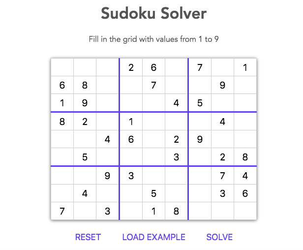

# Sudoku Solver
A sudoku solver implemented with backtracking and useful pruning of
solution search space.

Pruning decisions:
  - Most Constrained Square Selecton. Used to select the next sudoku grid cell 
    to fill but under the constraint that said cell is the most constrained of 
    all empty cells.

Note: Looking to implement look ahead pruning.

## Screenshot

## Built with
  * Vanilla-js
  * HTML5
  * CSS3

## Recommended readings on Backtracking
- [The Algorithm Design Manual](https://www.amazon.com/Algorithm-Design-Manual-Steven-Skiena/dp/1849967202/ref=sr_1_2?ie=UTF8&qid=1538350073&sr=8-2&keywords=algorithm+design+manual)
